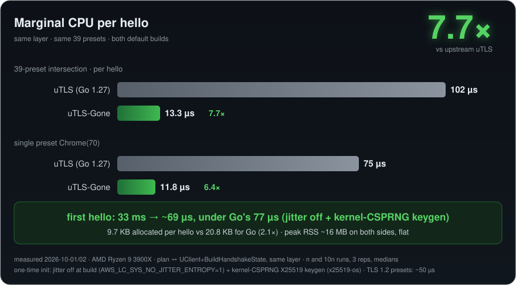

# uTLS-Gone

[](https://github.com/ArchivalEra/uTLS-Gone/actions/workflows/ci.yml)
[](https://github.com/ArchivalEra/uTLS-Gone/releases)
[](LICENSE)
[](Cargo.toml)
[](#crates)
[](crates/utls/tests/fixtures/utls-testdata/README.md)
[](https://github.com/ArchivalEra/uTLS-Gone)
[](https://github.com/ArchivalEra/uTLS-Gone/commits/main)

A Rust port of [refraction-networking/utls](https://github.com/refraction-networking/utls)
plus XTLS/REALITY. Given a browser fingerprint ("Chrome 133"), it produces a ClientHello
byte-identical to that browser's — checkable by re-running one command — and speaks REALITY
against stock Xray.

中文：[README.zh.md](README.zh.md)

## Crates

| crate | what it is |
|---|---|
| [`crates/utls`](crates/utls) | fingerprint layer: 41 presets, GREASE, padding, extension shuffling. No rustls types. |
| [`crates/utls-engine`](crates/utls-engine) | wires that layer into a vendored rustls through an 8-point fork seam ([`crates/rustls-fork`](crates/rustls-fork/README.md)) |
| [`crates/reality`](crates/reality) | REALITY: auth, mirror handshake (a half TLS 1.3 server), fallback passthrough |
| [`crates/x25519-os`](crates/x25519-os) | X25519 / X25519MLKEM768 keygen from the OS CSPRNG (libcrux ML-KEM + aws-lc X25519) |
| [`crates/rustls`](crates/rustls) | vendored rustls 0.23.45 with the fork seam |

## Performance

AMD Ryzen 9 3900X, same-day paired measurement against uTLS master (Go 1.27), same 39 presets.
Method: n and 10n runs, three reps, medians; single-preset probes separate one-time costs.
Repro: `crates/utls/tests/fixtures/gen-reference/bench/main.go` ↔
`cargo run --release -p utls-engine --example plan-cost`.



| | Go | this repo |
|---|---|---|
| marginal CPU per hello (39-preset mean) | 102 µs | **13.3 µs** (7.7×) |
| marginal, `chrome_133` (PQ-first) | 311.5 µs | **~50 µs** (6.2×) |
| first hello, cold (`chrome_70`) | ~200-280 µs | **~70-85 µs** |
| first hello, cold (`chrome_133`, PQ-first) | ~465-630 µs | **~130-160 µs** |
| allocated bytes per hello | 20.8 KB | **9.7 KB** |
| peak RSS | ~16 MB, flat | ~16 MB, flat |

Where the cold-start went: aws-lc jitter entropy is disabled at build time
([`.cargo/config.toml`](.cargo/config.toml)), and X25519 / MLKEM768 keygen takes kernel entropy
([`crates/x25519-os`](crates/x25519-os) — libcrux ML-KEM, aws-lc X25519; selected in a
four-implementation bake-off, interoperability with the stock aws-lc hybrid pinned by tests).

## Run

```bash
cargo test --workspace --all-features    # 216 criteria, all offline except two Xray tests
cargo run -p utls --example fingerprint -- chrome_133
PLANCOST_BREAKDOWN=1 cargo run --release -p utls-engine --example plan-cost -- 'Chrome(70)'
```

REALITY true-stack criteria need stock Xray-core (`REALITY_XRAY=/path/to/xray`); everything
else runs offline.

## Boundaries

- **REALITY mirror: no HelloRetryRequest.** The mirror copies the real site's ServerHello and
  re-keys it. If the real site answers the forwarded ClientHello with an HRR instead, there is
  nothing to re-key and the connection falls back to passthrough — same behavior as the Go
  reference. The TLS client in `utls-engine` does handle HRR
  (`tests/hello_retry_e2e.rs`).
- **REALITY: no ML-DSA-65 certificate signature.** Newer Xray can embed an ML-DSA-65
  (post-quantum) signature in the server's self-signed certificate — the `mldsa65_seed` /
  `mldsa65_verify` fields in its `config.proto`. We issue ed25519-based REALITY certificates;
  that field pair is the single "not implemented" row in `crates/reality/tests/parity.rs`.
- **PQ-first first-hello floor** is the ML-KEM-768 keygen itself (~25 µs of real math).

## License

Apache-2.0 for this repo's code; vendored rustls keeps Apache-2.0 / ISC / MIT;
uTLS-derived fixtures are BSD-3-Clause.
