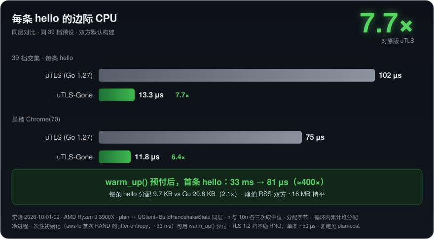

# uTLS-Gone（中文）

[](https://github.com/ArchivalEra/uTLS-Gone/actions/workflows/ci.yml)
[](https://github.com/ArchivalEra/uTLS-Gone/releases)
[](LICENSE)
[](Cargo.toml)
[](#crates)
[](crates/utls/tests/fixtures/utls-testdata/README.md)
[](https://github.com/ArchivalEra/uTLS-Gone)
[](https://github.com/ArchivalEra/uTLS-Gone/commits/main)

[refraction-networking/utls](https://github.com/refraction-networking/utls) 的 Rust 移植，
外加 XTLS/REALITY。给定一个浏览器指纹（"Chrome 133"），产出与那个浏览器**逐字节一致**的
ClientHello —— 一条命令可复核 —— 并以 REALITY 对接原版 Xray。

English: [README.md](README.md)

## Crates

| crate | 是什么 |
|---|---|
| [`crates/utls`](crates/utls) | 指纹层：41 档预设、GREASE、填充、扩展乱序。不引用任何 rustls 类型。 |
| [`crates/utls-engine`](crates/utls-engine) | 经 8 处插桩的 fork（[`crates/rustls-fork`](crates/rustls-fork/README.md)）把指纹字节接进 vendored rustls |
| [`crates/reality`](crates/reality) | REALITY：鉴权、镜像握手（半段 TLS 1.3 服务端）、fallback 透传 |
| [`crates/x25519-os`](crates/x25519-os) | 内核熵源的 X25519 / X25519MLKEM768 keygen（libcrux ML-KEM + aws-lc X25519） |
| [`crates/rustls`](crates/rustls) | vendored rustls 0.23.45 + fork 接缝 |

## 性能

AMD Ryzen 9 3900X，同日成对测量，对 uTLS master（Go 1.27），同 39 档预设。
口径：n 与 10n 各三次取中位；单档探针分离一次性成本。
复跑：`crates/utls/tests/fixtures/gen-reference/bench/main.go` ↔
`cargo run --release -p utls-engine --example plan-cost`。



| | Go | 本仓 |
|---|---|---|
| 每条 hello 的边际 CPU（39 档均值） | 102 µs | **13.3 µs**（7.7×） |
| 边际，`chrome_133`（PQ-first） | 311.5 µs | **~50 µs**（6.2×） |
| 首条 hello，冷进程（`chrome_70`） | ~200-280 µs | **~70-85 µs** |
| 首条 hello，冷进程（`chrome_133`，PQ-first） | ~465-630 µs | **~130-160 µs** |
| 每条 hello 的分配 | 20.8 KB | **9.7 KB** |
| 峰值 RSS | ~16 MB 持平 | ~16 MB 持平 |

冷启动开销从源头清掉：aws-lc 的 jitter 熵在构建期关闭（[`.cargo/config.toml`](.cargo/config.toml)），
X25519 / MLKEM768 的 keygen 用内核熵（[`crates/x25519-os`](crates/x25519-os) —— libcrux
ML-KEM + aws-lc X25519；四家实测定型，与 stock aws-lc 混合组的互操作有判据钉着）。

## 跑

```bash
cargo test --workspace --all-features    # 216 条判据，除两条 Xray 外全离线
cargo run -p utls --example fingerprint -- chrome_133
PLANCOST_BREAKDOWN=1 cargo run --release -p utls-engine --example plan-cost -- 'Chrome(70)'
```

REALITY 真栈判据需要原版 Xray-core（`REALITY_XRAY=/path/to/xray`）；其余全部离线可跑。

## 边界

- **REALITY 镜像：不做 HelloRetryRequest。** 镜像的做法是复制真站的 ServerHello 再换密钥；
  如果真站对转发过去的 ClientHello 回的是 HRR，那就没有东西可换，连接回落透传 —— 与 Go
  参照行为一致。`utls-engine` 里的 TLS 客户端**支持** HRR（判据在
  `tests/hello_retry_e2e.rs`）。
- **REALITY：不做 ML-DSA-65 证书签名。** 新版 Xray 可以在服务端自签证书里内嵌 ML-DSA-65
  （后量子）签名 —— 即它 `config.proto` 里的 `mldsa65_seed` / `mldsa65_verify` 字段。我们
  签发的是 ed25519 版 REALITY 证书；这对字段是 `crates/reality/tests/parity.rs` 里唯一的
  「未实现」行。
- **PQ-first 首条 hello 的地板**是 ML-KEM-768 keygen 本身（~25 µs 真数学）。

## License

本仓代码 Apache-2.0；vendored rustls 遵其原许可（Apache-2.0 / ISC / MIT）；
uTLS 派生夹具 BSD-3-Clause。
